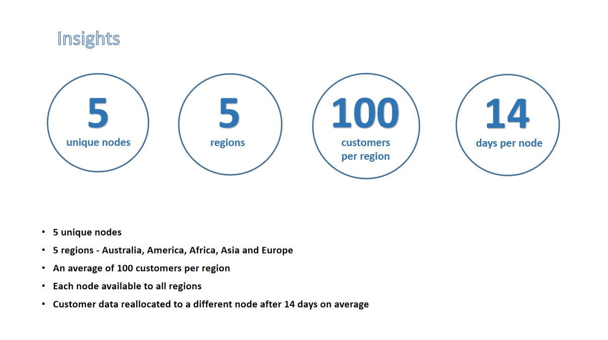
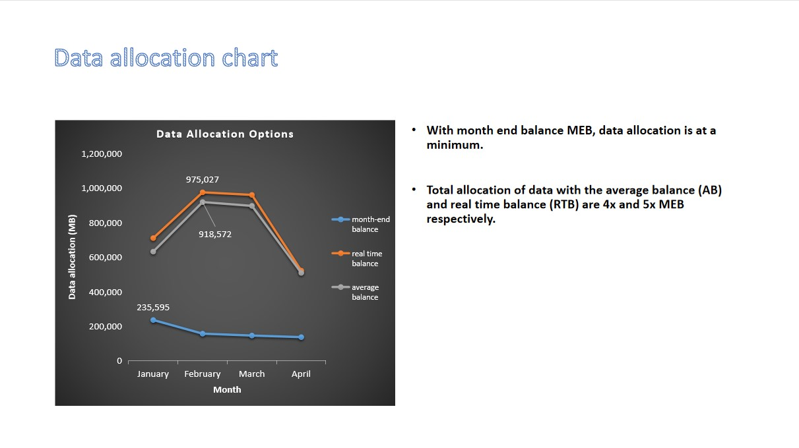

# Data-bank

### A case study in business analytics.

### Some of the questions I investigated include:

### Transactions analysis

* Unique count and total amount for each transaction type?
* Average total historical deposit counts and amounts for all customers?
* Closing balance for each customer at the end of the month?
* Percentage of customers who increase their closing balance by more than 5%?
* For each month - how many Data Bank customers make more than 1 deposit and either 1 purchase or 1 withdrawal in a single month?

### Forecasting
* If the annual interest rate is set at 6% and the Data Bank team wants to reward its customers by increasing their data allocation based off the interest calculated on a daily basis at the end of each day, how much data would be required for this option on a monthly basis?

## Reports
* Using the outputs generated from the customer node questions, generate a few headline insights which Data Bank might use to market it’s world-leading security features to potential investors and customers.
 

* With the results of the transaction analysis - I prepared a 1 page presentation slide which contains all the relevant information about the 3 options for data provisioning so the Data Bank management team can make an informed decision.
 

### Tools used:
* PostgreSQL
* Excel
* MS Power Point

